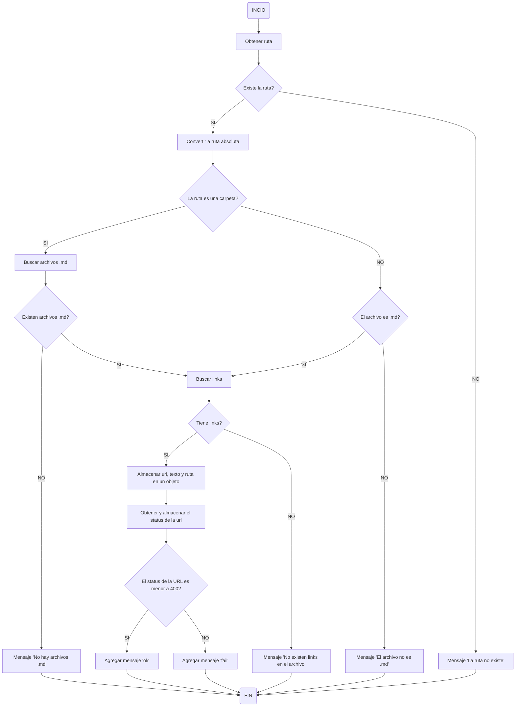

# MDLINKS

## Indice

-   [1. Resumen del proyecto](#1-preámbulo)

-   [2. Diagramas de flujo](#2-Resumen-del-proyecto)

-   [3. Instalación y uso de la librería](#3-criterios-del-proyecto)

-   [4. Objetivos de aprendizaje](#4-consideraciones-t%C3%A9cnicas)

-   [5. Checklist de criterios cumplidos](#5-checklist-de-criterios-cumplidos)

### 1. Resumen del proyecto

El proyecto trata de la creación de una herramienta de línea de comandos (CLI), así como también la creación de una librería desarrollada en lenguaje JavaScript el cual sera subido a [npm](https://www.npmjs.com/).
Esta librería buscará archivos de tipo **.md** dentro de la ruta que se le pase y nos nos indicará si estos son validos o no, además se mostrará algunas estadísticas de ellos: la cantidad de links que se encontró en total, la cantidad de links rotos y la cantidad de links únicos.

### 2. Diagramas de flujo

#### 2.1 Diagrama API

#### 2.2 Diagrama CLI

### 3. Instalación y uso de la librería

### 4. Objetivos de aprendizaje

### JavaScript

-   [ ] **Diferenciar entre tipos de datos primitivos y no primitivos**

-   [x] **Arrays (arreglos)**

-   [x] **Objetos (key, value)**

-   [x] **Uso de condicionales (if-else, switch, operador ternario, lógica booleana)**

-   [x] **Funciones (params, args, return)**

-   [ ] **Recursión o recursividad**

-   [x] **Módulos de CommonJS**

-   [ ] **Diferenciar entre expresiones (expressions) y sentencias (statements)**

-   [ ] **Callbacks**

-   [ ] **Promesas**

-   [ ] **Pruebas unitarias (unit tests)**

-   [ ] **Pruebas asíncronas**

-   [ ] **Uso de mocks y espías**

-   [ ] **Pruebas de compatibilidad en múltiples entornos de ejecución**

-   [x] **Uso de linter (ESLINT)**

-   [x] **Uso de identificadores descriptivos (Nomenclatura y Semántica)**

### Node.js

-   [x] **Instalar y usar módulos con npm**

-   [x] **Configuración de package.json**

-   [ ] **Configuración de npm-scripts**

-   [ ] **process (env, argv, stdin-stdout-stderr, exit-code)**

-   [x] **File system (fs, path)**

### Control de Versiones (Git y GitHub)

-   [x] **Git: Instalación y configuración**

-   [x] **Git: Control de versiones con git (init, clone, add, commit, status, push, pull, remote)**

-   [ ] **Git: Integración de cambios entre ramas (branch, checkout, fetch, merge, reset, rebase, tag)**

-   [ ] **GitHub: Creación de cuenta y repos, configuración de llaves SSH**

-   [x] **GitHub: Despliegue con GitHub Pages**

-   [ ] **GitHub: Colaboración en Github (branches | forks | pull requests | code review | tags)**

-   [x] **GitHub: Organización en Github (projects | issues | labels | milestones | releases)**

### HTTP

-   [ ] **Consulta o petición (request) y respuesta (response).**

-   [x] **Codigos de status de HTTP**

### 5. Checklist de criterios cumplidos

### General

-   [ ] Puede instalarse via `npm install --global <github-user>/md-links`

### `README.md`

-   [ ] Un board con el backlog para la implementación de la librería.
-   [ ] Documentación técnica de la librería.
-   [ ] Guía de uso e instalación de la librería

### API `mdLinks(path, opts)`

-   [ ] El módulo exporta una función con la interfaz (API) esperada.
-   [ ] Implementa soporte para archivo individual
-   [ ] Implementa soporte para directorios
-   [ ] Implementa `options.validate`

### CLI

-   [ ] Expone ejecutable `md-links` en el path (configurado en `package.json`)
-   [ ] Se ejecuta sin errores / output esperado
-   [ ] Implementa `--validate`
-   [ ] Implementa `--stats`

### Pruebas / tests

-   [ ] Pruebas unitarias cubren un mínimo del 70% de statements, functions,
        lines, y branches.
-   [ ] Pasa tests (y linters) (`npm test`).
